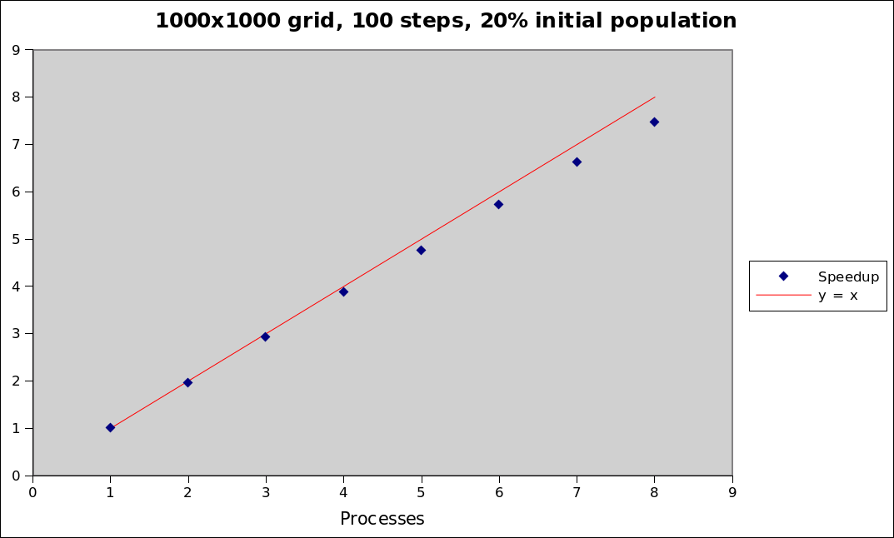

GameOfLifeParallel
==================

Student's course project - parallel solution to the Game of life problem with the use of the OpenMPI library. The repository also includes a serial version of the same program.

# How to run

The serial version can be compiled and run like any standard cpp application. To compile the parallel version, use the **mpic++** command. Execute it by invoking the **mpirun** command, e.g if you want to run it on 4 simultaneous processes, the commands are:
```
mpic++ life_parallel.cpp -o life_parallel.x
mpirun -np 4 life_parallel.x
```

# Sample output

_The program outputs PGM images, however a GIF animation is presentd insted_


# Speedup

_Calculated by running simulations on the [Physon cluster](http://physon.phys.uni-sofia.bg/) (Faculty of Physics, Sofia Unviersity "St. Kliment Ohridski", Bulgaria)_

